## Когда применять

Восстановление битого OCR по ступеням с оценкой качества: склейки, мусорные символы. Триггеры: «битый OCR», «скан распознан криво».

# OCR Scan Restoration

## Overview

Damaged scans need tiered treatment: not every document needs full reconstruction, and full reconstruction on every page wastes time. This skill applies progressively deeper fixes guided by a **quality score** measured after each tier. Stop the moment quality is sufficient.

**Core principle:** Measure first, fix proportionally, measure again.

---

## When to Use

```dot
digraph ocr_decision {
    rankdir=LR;
    "Got OCR text?" [shape=diamond];
    "Score quality" [shape=box];
    "Score >= 0.9?" [shape=diamond];
    "Score >= 0.7?" [shape=diamond];
    "Score >= 0.45?" [shape=diamond];
    "Tier 0: Accept" [shape=box, style=filled, fillcolor=lightgreen];
    "Tier 1: Auto cleanup" [shape=box];
    "Tier 2: Deep repair" [shape=box];
    "Tier 3: LLM rewrite" [shape=box];
    "Tier 4: Block rewrite" [shape=box];
    "Re-score after each tier" [shape=diamond];

    "Got OCR text?" -> "Score quality";
    "Score quality" -> "Score >= 0.9?" ;
    "Score >= 0.9?" -> "Tier 0: Accept" [label="yes"];
    "Score >= 0.9?" -> "Score >= 0.7?" [label="no"];
    "Score >= 0.7?" -> "Tier 1: Auto cleanup" [label="no"];
    "Score >= 0.7?" -> "Tier 0: Accept" [label="yes (good enough)"];
    "Tier 1: Auto cleanup" -> "Re-score after each tier";
    "Re-score after each tier" -> "Score >= 0.45?" [label="still bad"];
    "Re-score after each tier" -> "Tier 0: Accept" [label="good enough"];
    "Score >= 0.45?" -> "Tier 2: Deep repair" [label="no"];
    "Score >= 0.45?" -> "Tier 1: Auto cleanup" [label="yes"];
    "Tier 2: Deep repair" -> "Tier 3: LLM rewrite" [label="still bad"];
    "Tier 3: LLM rewrite" -> "Tier 4: Block rewrite" [label="still bad"];
}
```



**Use this skill when:**
- OCR output has >5% unrecognizable words
- Words are systematically merged (`этопроблема`) or split (`э то п р о б л е м а`)
- Special characters appear mid-word (`Сист!ема`, `приб*ор`)
- Whole paragraphs are unreadable after standard OCR
- Working with old documents (pre-reform spelling, historical scripts)
- Input is a low-DPI or physically damaged scan

**Don't use when:**
- OCR quality score > 0.9 (clean scan, nothing to fix)
- Only 1–3 isolated typos (just fix them directly)

---

## Step 0: Measure Quality Score

Before any repair, calculate a **garble score** for each block:

```python
import re

def ocr_quality_score(text: str) -> float:
    """Returns 0.0 (unreadable) to 1.0 (perfect)."""
    if not text.strip():
        return 0.0

    total = len(text)

    # Garbage signal: non-alphabetic chars inside words
    garbage_chars = len(re.findall(r'[!*|#@$%^&\\<>~`]', text))

    # Digits inside alphabetic words (OCR mistaking letters for digits)
    digit_in_word = len(re.findall(r'[A-Za-zА-Яа-яёЁ]\d[A-Za-zА-Яа-яёЁ]', text))

    # Impossibly long tokens (merged words: > 18 chars)
    long_tokens = sum(1 for w in text.split() if len(w) > 18)

    # Letter-spaced fragments: single letters separated by spaces ("э т о")
    spaced_letters = len(re.findall(r'(?<!\w)[A-Za-zА-Яа-яёЁ] [A-Za-zА-Яа-яёЁ] [A-Za-zА-Яа-яёЁ](?!\w)', text))

    # Short incoherent fragments (2-3 non-word chars sequences)
    garbage_clusters = len(re.findall(r'[^\w\s,.;:!?«»\-–—]{2,}', text))

    # Micro-token splits: 1-2 char alphabetic tokens surrounded by longer tokens
    # Catches split words like "тв ёрдых", "пе р еда ётся", "у дельный"
    words = text.split()
    micro_splits = sum(
        1 for i, w in enumerate(words)
        if len(w) <= 2 and w.isalpha()
        and (i > 0 and words[i-1].isalpha() or i < len(words)-1 and words[i+1].isalpha())
    )

    # Garbage density: even 5-10 garbage chars in 200-char block is severe
    # Normalize by block length AND by absolute count to catch dense damage
    garbage_density = garbage_chars / max(len(words), 1)  # per-word ratio

    penalty = (
        garbage_chars * 3 +
        digit_in_word * 4 +
        long_tokens * 5 +
        spaced_letters * 2 +
        garbage_clusters * 6 +
        micro_splits * 3 +
        garbage_density * 15  # density penalty independent of block length
    )

    score = max(0.0, 1.0 - penalty / max(total, 1))
    return round(score, 3)
```

**Thresholds:**

| Score | Tier | Action |
|-------|------|--------|
| ≥ 0.90 | 0 | Accept as-is |
| 0.70–0.89 | 1 | Basic auto-cleanup |
| 0.45–0.69 | 2 | Deep pattern repair |
| 0.20–0.44 | 3 | LLM block reconstruction |
| < 0.20 | 4 | Full manual block rewrite |

**Always score per block** (paragraph or page), not the whole document — some blocks may be Tier 0 while others need Tier 4.

**When formula score and visual assessment diverge — trust your eyes.** The formula catches specific patterns (garbage chars, long tokens, micro-splits) but can miss:
- Semantically wrong words that look clean (`веоь` instead of `вес` — no garbage chars, but wrong)
- Merged words just under the 18-char threshold
- Systematic character substitutions (`!` for `и`, `0` for `О`)

When you suspect damage that the formula doesn't detect, inspect the block manually and escalate the tier.

---

## Tier 1: Automated Cleanup

Apply in order. Re-score after each function group. Stop if score ≥ 0.9.

### 1.1 Invisible and control characters

```python
import unicodedata

def clean_control_chars(text: str) -> str:
    # Remove soft hyphens (U+00AD) — common OCR line-break artifact
    text = re.sub(r'([A-Za-zА-Яа-яёЁ])\u00AD\s*([A-Za-zА-Яа-яёЁ])', r'\1\2', text)
    # Normalize non-breaking spaces, zero-width chars
    text = text.replace('\u00a0', ' ').replace('\u200b', '').replace('\ufeff', '')
    # Collapse multiple spaces
    text = re.sub(r'  +', ' ', text)
    return text
```

### 1.2 Letter-spacing collapse
When OCR spaces out individual letters: `"э т о п р и м е р"` → `"это пример"`

```python
def collapse_letter_spacing(text: str) -> str:
    # Detect runs of single-letter tokens (≥ 4 in a row)
    def join_run(m):
        return m.group(0).replace(' ', '')
    pattern = r'(?<!\w)([A-Za-zА-Яа-яёЁ] ){3,}[A-Za-zА-Яа-яёЁ](?!\w)'
    return re.sub(pattern, join_run, text)
```

### 1.3 Merged prepositions / conjunctions (language-specific)

For Russian, English, etc. — add the most common short prepositions that get glued to the next word:

```python
# Russian example
PREPOSITIONS = ['в', 'на', 'из', 'по', 'к', 'от', 'до', 'за', 'для', 'под', 'над',
                'без', 'при', 'про', 'об', 'со', 'во', 'о', 'а', 'и', 'но', 'или']

def fix_merged_prepositions(text: str) -> str:
    for prep in PREPOSITIONS:
        # prep glued to next word: "вдоме" → "в доме"
        pattern = rf'\b({prep})([А-ЯA-Zа-яa-z]{{4,}})\b'
        text = re.sub(pattern, rf'\1 \2', text, flags=re.IGNORECASE)
    return text
```

### 1.4 Known OCR substitutions

Build a dictionary of systematic OCR errors for your scanner/font:

```python
# Common OCR mistakes (extend for your document)
OCR_FIXES = {
    # Latin lookalikes
    'ЗЗ': 'Зз',    # double-Z from bleed
    'рн': 'рн',    # sometimes OK, sometimes "м"
    # Specific to old print
    'ѣ': 'е',      # old Russian yat → е
    'ъ': '',       # trailing hard sign (removed in 1918 reform)
    'і': 'и',      # dotted i → и
    'ѳ': 'ф',      # fita → ф
    # Classic OCR confusion: old Cyrillic і (dotted i) is often read as ! or 1
    # Apply contextually — inside alphabetic words only
    # Do NOT apply globally: '!': 'и' would break sentence punctuation
    # Instead use regex: re.sub(r'(?<=[А-Яа-яёЁ])!(?=[А-Яа-яёЁ])', 'и', text)
    # Digit/letter confusion
    '0': 'о',      # zero vs letter o — apply only at word start (context-dependent)
    'l': 'л',      # in Cyrillic context
}

def apply_ocr_dict(text: str, fixes: dict) -> str:
    for bad, good in fixes.items():
        text = text.replace(bad, good)
    return text
```

---

## Tier 2: Deep Pattern Repair

Use when Tier 1 leaves score between 0.45–0.69. Apply morphological and context-window analysis.

**Important limitation:** The `fix_split_words` heuristic catches suffix-boundary splits but not arbitrary mid-syllable breaks (e.g., `пе р еда ётся`, `тв ёрдых`). If you see random intra-syllable fragmentation throughout a block, skip Tier 2 and escalate directly to Tier 3 (LLM reconstruction) — the morphological approach won't help.

### 2.1 Morphological word-split detector

Detect words broken by spaces using suffix/prefix patterns of the document's language:

```python
# Russian morphological suffixes and common endings
RUSSIAN_SUFFIXES = [
    'ость', 'ение', 'ание', 'ство', 'ние', 'тие', 'мость',
    'ный', 'ная', 'ное', 'ных', 'ний', 'нии', 'ием',
    'ться', 'тся', 'ться', 'ются', 'ется',
]

def fix_split_words(text: str) -> str:
    words = text.split()
    result = []
    i = 0
    while i < len(words):
        if i + 1 < len(words):
            combined = words[i] + words[i+1]
            # If suffix of first + start of second = valid morpheme
            for suffix in RUSSIAN_SUFFIXES:
                if words[i].endswith(suffix[:2]) and words[i+1].startswith(suffix[2:]):
                    result.append(combined)
                    i += 2
                    break
            else:
                result.append(words[i])
                i += 1
        else:
            result.append(words[i])
            i += 1
    return ' '.join(result)
```

### 2.2 Long-token splitter

Tokens > 18 chars are almost always merged words. Try to split at likely boundaries:

```python
def split_long_tokens(text: str) -> str:
    def try_split(token: str) -> str:
        if len(token) < 18:
            return token
        # Try split at preposition boundaries
        for prep in ['в', 'на', 'из', 'по', 'к', 'от']:
            idx = token.find(prep, 3)  # don't split at position 0-2
            if 3 < idx < len(token) - 3:
                return token[:idx] + ' ' + token[idx:]
        return token
    return ' '.join(try_split(w) for w in text.split())
```

### 2.3 Garbage fragment filter

Remove isolated fragments that are clearly non-text (usually scan artifacts):

```python
def remove_garbage_fragments(text: str) -> str:
    lines = text.split('\n')
    clean = []
    for line in lines:
        # Skip lines that are >50% non-alphabetic
        alpha = sum(1 for c in line if c.isalpha())
        if len(line) > 5 and alpha / len(line) < 0.4:
            continue  # garbage line
        clean.append(line)
    return '\n'.join(clean)
```

---

## Tier 3: LLM Block Reconstruction

When automated repair fails (score < 0.45), send each corrupt block to an LLM with full context.

### Structure the prompt correctly

```python
def reconstruct_block_with_llm(
    corrupt_text: str,
    document_context: str,
    preceding_clean: str,
    language: str = "Russian"
) -> str:
    prompt = f"""You are restoring a damaged OCR scan of a document.

DOCUMENT CONTEXT (what this document is about):
{document_context}

PRECEDING CLEAN TEXT (for continuity):
{preceding_clean}

CORRUPT OCR BLOCK TO RESTORE:
{corrupt_text}

Instructions:
1. Read the corrupt block carefully. Most words are recognizable fragments.
2. Use document context and preceding text to understand the topic.
3. Reconstruct the full coherent text in {language}.
4. Preserve all technical terms, numbers, references (figure numbers, etc.).
5. Do NOT add information not implied by the corrupt text.
6. Return ONLY the restored text, no explanations.

RESTORED TEXT:"""
    return call_llm(prompt)
```

### Key parameters for reconstruction

- **Temperature: 0.1** — low creativity, high fidelity
- **Include document_context** — even 2–3 sentences about the topic dramatically improves reconstruction
- **Include 2–3 preceding clean paragraphs** — continuity prevents hallucination
- **Process block by block**, not the whole document — shorter context = better focus

---

## Tier 4: Full Manual Block Rewrite

When Tier 3 still produces unreliable output (score < 0.20, or LLM hallucinating).

### The dump-debug-rewrite loop

```python
# 1. Dump all blocks to a text file for human review
def dump_blocks(blocks: list[dict], output_path: str) -> None:
    with open(output_path, 'w', encoding='utf-8') as f:
        for i, block in enumerate(blocks):
            f.write(f'=== BLOCK {i} ({block.get("type", "body")}) ===\n')
            f.write(block.get('text', '') + '\n\n')

# 2. Identify corrupt blocks (those with score < threshold)
corrupt_indices = [
    i for i, b in enumerate(blocks)
    if ocr_quality_score(b.get('text', '')) < 0.45
]

# 3. Store manual corrections by block index
MANUAL_CORRECTIONS = {
    # Written after reading the dump and domain knowledge
    5: "При нагревании большинство твёрдых и жидких тел расширяется...",
    7: "Тепло передаётся лучеиспусканием и прикосновением...",
    # etc.
}

# 4. Apply corrections
def apply_manual_corrections(blocks: list[dict], corrections: dict) -> list[dict]:
    for i, block in enumerate(blocks):
        if i in corrections:
            block['text'] = corrections[i]
    return [b for b in blocks if b.get('text', '').strip()]
```

### How to write manual corrections

When reading the dump:
1. **Find where the sentence was going** — even `"гор ения"` implies `"горения"`
2. **Use domain knowledge** — what topic is this page about?
3. **Look at the preceding and following clean blocks** — reconstruct the argument flow
4. **Verify numbers and proper nouns** — these are usually recognizable even in garbage
5. **Write naturally** — don't try to preserve garbage; rewrite the whole sentence

---

## The Dump-Debug Cycle (Critical Pattern)

**Always generate a text dump before creating the final document.** This is the fastest feedback loop.

```
write fix → generate_dump() → read dump → spot errors → write more fixes → repeat
```

Never go straight from raw OCR to final document. The dump reveals:
- Which blocks still have garbage
- Whether your regex is over-applying
- Blocks that need escalation to a higher tier

**Name dumps sequentially:** `blocks_dump_v1.txt`, `v2.txt`, etc. Keep old ones for comparison.

---

## Integration Template

```python
def process_document(
    ocr_text: str,
    document_context: str = "",
    language: str = "auto"
) -> list[dict]:
    """Full tiered OCR restoration pipeline."""

    # 1. Split into blocks (paragraphs or pages)
    blocks = split_into_blocks(ocr_text)

    # 2. Tier 1: automated cleanup for all blocks
    for block in blocks:
        block['text'] = clean_control_chars(block['text'])
        block['text'] = collapse_letter_spacing(block['text'])
        block['text'] = fix_merged_prepositions(block['text'])

    # 3. Score and escalate
    for block in blocks:
        score = ocr_quality_score(block['text'])
        block['score'] = score

        if score >= 0.7:
            continue  # Good enough

        # Tier 2: Deep repair
        block['text'] = fix_split_words(block['text'])
        block['text'] = split_long_tokens(block['text'])
        block['text'] = remove_garbage_fragments(block['text'])
        block['score'] = ocr_quality_score(block['text'])

        if block['score'] >= 0.45:
            continue  # Tier 2 was enough

        # Tier 3: LLM reconstruction
        preceding = get_preceding_clean_text(blocks, block)
        block['text'] = reconstruct_block_with_llm(
            block['text'], document_context, preceding, language
        )
        block['score'] = ocr_quality_score(block['text'])

        # Tier 4: Flag for manual rewrite if still bad
        if block['score'] < 0.20:
            block['needs_manual'] = True

    # 4. Dump for review before finalizing
    dump_blocks(blocks, 'blocks_dump.txt')

    return blocks
```

---

## Language-Specific Plugins

The core pipeline is universal. Add language modules as needed:

| Language | Extra fixes needed |
|----------|--------------------|
| Russian pre-1918 | Convert ѣ→е, ъ→∅ at end of words, і→и, ѳ→ф |
| German Fraktur | s/ß confusion, ü/ü lookalike |
| Old English | Long-s (ſ) → s, yogh, thorn |
| Arabic | Direction markers, hamza variants |
| Any | Build custom `OCR_FIXES` dict from your scanner's error patterns |

To build your scanner-specific dictionary: **scan 5–10 pages, identify the top 20 recurring errors, add them to `OCR_FIXES`**. Systematic OCR errors repeat predictably.

---

## Common Mistakes

| Mistake | Fix |
|---------|-----|
| Applying Tier 3 (LLM) to every block | Score first — most blocks need only Tier 1 |
| Skipping the dump step | You won't see where your fixes broke clean text |
| Over-aggressive regex splitting | Always check that split didn't break good words |
| Generic prompt for LLM reconstruction | Add document_context — it cuts hallucination by 80% |
| Processing whole document as one block | Process block-by-block; score per block |
| Rebuilding the error dictionary each run | Persist `OCR_FIXES` — your scanner's errors are deterministic |
| Going straight to manual rewrite | Try Tier 2 and 3 first — saves hours |

---

## Quality Thresholds Reference

| Score | Typical appearance | Action |
|-------|--------------------|--------|
| 0.95–1.0 | Clean, typos only | Accept as-is |
| 0.80–0.94 | Occasional merged words | Tier 1 (5 min) |
| 0.60–0.79 | Many artifacts, still readable | Tier 1+2 (15 min) |
| 0.40–0.59 | Partially reconstructible | Tier 2+3 LLM |
| 0.20–0.39 | Mostly garbage, structure visible | Tier 3 LLM with strong context |
| 0.00–0.19 | Almost unreadable | Tier 4 manual rewrite per block |
